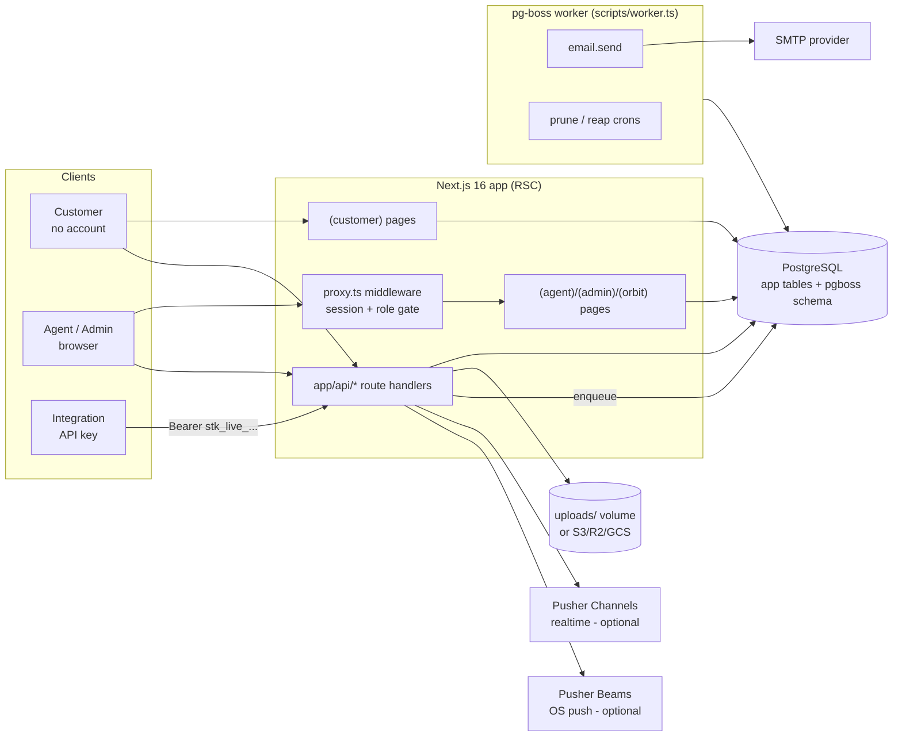
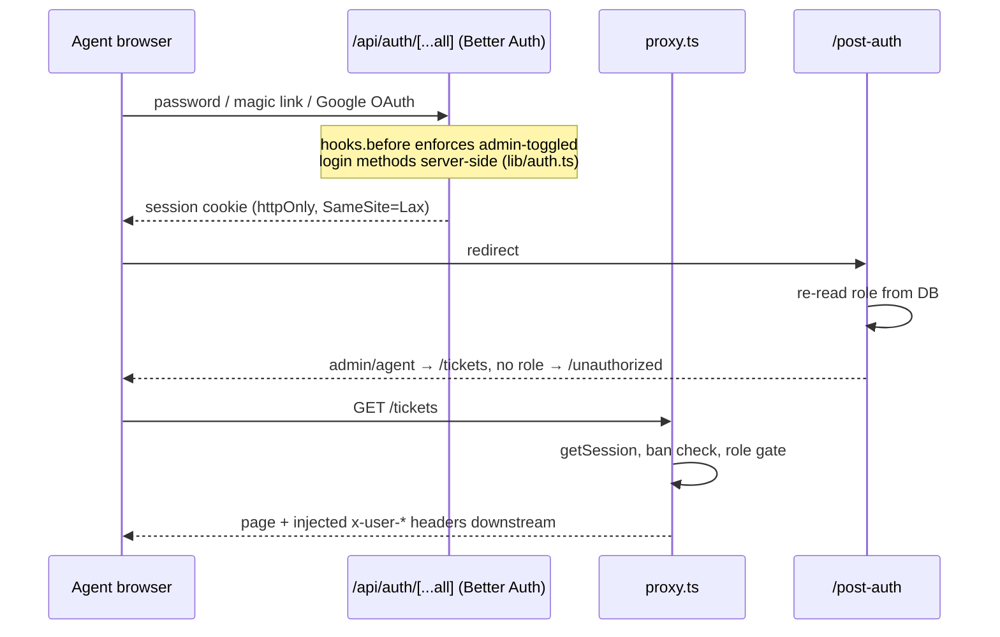
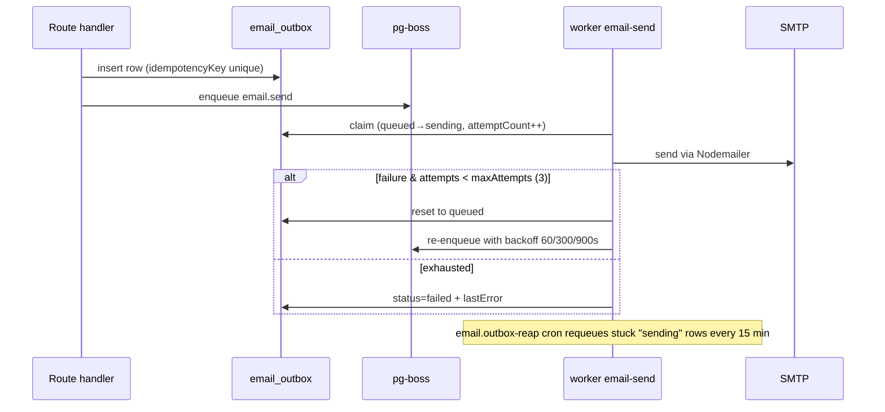

# PROJECT_REVIEW.md — Support Tool

> **Scope:** Static analysis of the `main` branch of `Support-tool` as of 2026-07-14 (commit `4729954 fix bugs`, plus uncommitted UI-polish edits in the working tree). No files other than this document were created or modified. All findings are based on the current codebase; anything absent is explicitly marked **Not Implemented**.

---

## 1. Executive Summary

**Project purpose.** Support Tool is an open-source, **self-hosted customer support ticketing system** (Freshdesk/Crisp-inspired). Teams deploy it via Docker to receive, triage, and answer customer support tickets.

**Primary features.**
- Anonymous customer portal: submit tickets, view/reply/close/reopen via secure emailed token links (no customer accounts).
- Agent portal: ticket list with rich filtering, ticket detail with public replies + internal notes, assignment, canned responses, dashboard with stats, in-app notification bell + OS push (Pusher Beams), live updates (Pusher Channels).
- Admin portal: user management (invite/role/ban/delete), dynamic statuses/categories/priorities, theme + login-method settings, API keys, audit log, first-run setup wizard.
- Public REST API (`/api/v1`) with hashed bearer API keys, OpenAPI 3.1 spec + Scalar docs + Postman collection.
- Background jobs (pg-boss): transactional email outbox with app-managed retries, pruning jobs.
- "Orbit" platform-operator surface (queues, email outbox, users).

**Current development status.** All 10 phases of `docs/development-plan.md` are implemented, plus ~10 post-plan additions (public API, realtime, notifications, audit log, canned responses, rate limiting, setup wizard, Orbit). The product is **feature-complete for its MVP scope**.

**Technology stack.** Next.js 16 (App Router, RSC) · TypeScript · PostgreSQL · Drizzle ORM · Better Auth · Tailwind CSS v4 + shadcn/ui · pg-boss · Nodemailer + react-email · Tiptap · Pusher (Channels + Beams, optional) · Docker Compose.

**Overall architecture.** A single Next.js app (RSC-first, no client-side data-fetching library) + a separate pg-boss worker process, both against one PostgreSQL database. Auth is three-modal: Better Auth sessions (agents/admins, enforced centrally in `proxy.ts` middleware), per-ticket bearer tokens (customers), and hashed API keys (integrations). Email goes through a transactional outbox table drained by the worker.

**Estimated production readiness: 72 / 100.**

**Biggest strengths.**
1. Clean, consistent architecture: central middleware gate + header injection, shared validation client/server, transactional email outbox with idempotency, Postgres-backed rate limiting that survives restarts.
2. Genuinely good security fundamentals: hashed API keys, HMAC customer-list tokens with `timingSafeEqual`, Tiptap-only rendering (no `dangerouslySetInnerHTML` on user data), parameterized SQL everywhere, server-side enforcement of login-method toggles.
3. Complete self-host packaging: Docker Compose with one-shot migrate service, external-DB variant, setup wizard, seeding, admin bootstrap scripts.

**Biggest weaknesses.**
1. **Zero automated tests and zero CI** — the single largest gap.
2. Two high-severity security issues: unauthenticated file serving (`/api/files/[...key]`) and no rate limiting/lockout on authentication endpoints.
3. No security headers/CSP, no health endpoint, no error tracking/monitoring; `/orbit` admin area appears unreachable due to a middleware-matcher bug.

---

## 2. Project Structure

```
Support-tool/
├── app/
│   ├── (auth)/            # Agent/admin login, forgot/reset password (unauthenticated layout)
│   ├── (customer)/        # Customer portal: /submit, /ticket/[id], /my-tickets (token-gated, light-only)
│   ├── (agent)/           # Agent portal: /dashboard, /tickets, /canned-responses (session, agent+)
│   ├── (admin)/           # Admin pages: /admin/users, ticket-config, appearance, api-keys, audit-log
│   ├── (orbit)/           # Platform-operator surface: /orbit (queues, email outbox, users)
│   ├── (setup)/           # First-run setup wizard (/setup, self-disabling)
│   ├── actions/           # Server actions (auth, profile, orbit-users)
│   ├── api/               # All REST route handlers (see §6/§8)
│   ├── post-auth/         # Post-login role router
│   ├── unauthorized/      # "Access pending" page for role-less users
│   ├── error.tsx, global-error.tsx, not-found.tsx, layout.tsx, page.tsx, globals.css
├── components/
│   ├── ui/                # shadcn/ui primitives (Radix-based)
│   ├── common/            # Shared app components (rich-text editor, searchable select, attachments)
│   ├── agent/, admin/, orbit/, profile/, theme/  # Feature-scoped components
├── config/platform.ts     # PRODUCT_NAME, roles, platform constants
├── db/
│   ├── schema/            # Drizzle table definitions (12 files, one per domain)
│   ├── migrations/        # 11 generated SQL migrations (0000–0010) + meta snapshots
│   └── reset.ts           # Dev-only DB reset
├── docs/                  # 17 feature specs + docs/plans/ per-feature write-ups
├── lib/
│   ├── auth.ts / auth-client.ts / authz.ts   # Better Auth server/client + authz helpers
│   ├── db.ts              # Drizzle + postgres-js pooled singleton
│   ├── storage.ts         # File storage adapter (local fs → S3/R2/GCS)
│   ├── email/             # react-email templates + enqueue helper + renderer
│   ├── smtp/              # Nodemailer SMTP client
│   ├── worker/            # pg-boss instance, queues, handlers, enqueue, inspection
│   ├── tickets/           # Shared ticket-creation logic
│   ├── rate-limit.ts, audit.ts, notifications.ts, push.ts, realtime.ts,
│   │   rich-text.ts, api-keys.ts, api-auth.ts, customer-access.ts,
│   │   settings.ts, setup.ts, ticket-config.ts, env.ts, openapi-spec.ts, …
├── scripts/               # worker.ts (worker entry), setup.ts, create-admin.ts, make-admin.ts,
│                          # seed-defaults.ts, dev-db.ts (embedded-postgres)
├── examples/support-widget-demo/   # Embeddable widget demo
├── types/                 # Ambient types (pusher-js)
├── uploads/               # Local dev file storage (fs adapter)
├── proxy.ts               # Next.js 16 middleware (renamed from middleware.ts)
├── instrumentation.ts     # onRequestError server-side error logger
├── Dockerfile, Dockerfile.worker, docker-compose.yml, docker-compose.external-db.yml
├── drizzle.config.ts, biome.jsonc, next.config.mjs, tsconfig.json
└── CLAUDE.md, AGENTS.md, README.md, CONTRIBUTING.md
```

---

## 3. Tech Stack

| Layer | Technology | Version |
|---|---|---|
| Framework | Next.js (App Router, RSC) | 16.2.9 |
| Runtime | Node.js (Docker: `node:22-alpine` / worker `node:22-bookworm-slim`) | 22 |
| Language | TypeScript | ^6.0.3 |
| Database | PostgreSQL (Compose: `postgres:17-alpine`) | 17 |
| ORM | Drizzle ORM + drizzle-kit | ^0.45.2 / ^0.31.10 |
| DB driver | postgres-js | ^3.4.9 |
| Authentication | Better Auth (admin plugin, magic link, Google OAuth) | ^1.6.18 |
| UI Library | shadcn/ui on Radix (`radix-ui ^1.5.0`, `shadcn ^4.11.0`) | — |
| Icons | @phosphor-icons/react | ^2.1.10 |
| State Management | None (RSC + `Suspense` + `router.refresh()`; **no SWR/Zustand in use**) | — |
| Styling | Tailwind CSS v4 (+ tw-animate-css) | ^4.3.1 |
| Rich text | Tiptap (react, starter-kit, link, underline, placeholder, suggestion, html) | ^3.27.1 |
| Background Jobs | pg-boss | ^12.19.1 |
| Email | Nodemailer (SMTP) + react-email templates | ^8.0.11 / ^6.6.0 |
| File Storage | files-sdk-style adapter in `lib/storage.ts` (local fs → S3/R2/GCS) | — |
| Realtime | Pusher Channels (`pusher ^5.3.4`, `pusher-js ^8.5.0`) — optional | — |
| Push | Pusher Beams (`@pusher/push-notifications-*`) — optional | — |
| Validation | zod (env only: `lib/env.ts`); API routes use manual validation | ^4.4.3 |
| IDs | cuid2 (@paralleldrive/cuid2) | ^3.3.0 |
| API docs | @scalar/api-reference-react + hand-built OpenAPI 3.1 (`lib/openapi-spec.ts`) | ^0.9.54 |
| Toasts | sonner | ^2.0.7 |
| Lint/format | Biome + Ultracite | 2.5.0 / 7.8.3 |
| Package manager | pnpm | 11.6.0 |
| Local dev DB | embedded-postgres (dev-only) | 18.4.0-beta.17 |
| Deployment | Docker + Docker Compose (app / worker / migrate / postgres) | — |
| Payments | **Not Implemented** | — |
| Analytics | **Not Implemented** | — |
| Error tracking (Sentry etc.) | **Not Implemented** (console logging only) | — |
| Testing | **Not Implemented** (no test framework) | — |
| CI/CD | **Not Implemented** (no `.github/`) | — |

---

## 4. Application Architecture

### High-level architecture



### Request lifecycle
1. **Pages (agent/admin):** request → `proxy.ts` (only for matched paths) validates the Better Auth session cookie, rejects banned users, enforces role, and injects `x-user-id/name/email/role/x-pathname` headers → route-group layout re-asserts via `lib/authz.ts` (`requireAgent`/`requireAdmin`) → RSC page queries Drizzle directly → streamed HTML with `Suspense` skeletons.
2. **Pages (customer):** no middleware; the page itself validates the `?token=` query param against `tickets.customerToken`, or the HMAC email token (`lib/customer-access.ts`) for `/my-tickets/[token]`.
3. **API:** matched routes rely on proxy-injected headers (`requireAdminFromRequest` etc.); unmatched routes (`/api/tickets/*`, `/api/v1/*`, `/api/pusher/auth`, …) do their own auth inside the handler.
4. **Mutations:** client components `fetch()` the API, then `router.refresh()` to re-render RSC data; Sonner toasts for feedback. Realtime components subscribe to Pusher channels and refresh on events.

### Authentication flow (agents/admins)



### Authorization model
- **Roles:** `user.role` ∈ `admin` | `agent` | `"user"` (default = no access, lands on `/unauthorized`).
- **Central gate:** `proxy.ts` matcher covers `/dashboard`, `/tickets`, `/admin`, `/canned-responses`, `/api/admin`, `/api/stats`, `/api/agents`, `/api/users`, `/api/account`, `/api/notifications`, `/api/canned-responses`. `/admin/*` + `/api/admin/*` require `admin`; the rest require `agent|admin`.
- **Flat agent tier:** any agent can view/edit/assign **any** ticket (single-tenant by design; see §14 A3). Ticket **delete** and **bulk ops** are admin-only.
- **Customers:** per-ticket `customerToken` (cuid2, non-expiring) in the URL; "My Tickets" uses a 7-day HMAC token.
- **Integrations:** `Authorization: Bearer stk_live_…`; SHA-256 hash lookup; soft revoke.

### File upload flow
`POST /api/tickets` or `POST /api/tickets/[id]/comments` (multipart) → MIME allow-list (jpeg/png/pdf/zip/txt), ≤10 MB/file, ≤5 files → stored via `lib/storage.ts` at key `tickets/{ticketId}/{cuid2}.{ext}` (local `uploads/` in dev; S3-compatible in prod) → DB row in `ticket_attachments` stores the **key**, never a URL → served by `GET /api/files/[...key]` (**currently unauthenticated — see §14 A4**). Storage write is rolled back if the DB insert fails.

### Email flow (transactional outbox)



### Payment flow
**Not Implemented** (no payments in this product).

---

## 5. Feature Inventory

| # | Feature | Status | Key files | Endpoints | Tables | Known limitations |
|---|---|---|---|---|---|---|
| 1 | Customer ticket submission | ✅ Complete | `app/(customer)/submit/`, `lib/tickets/create-ticket.ts` | `POST /api/tickets` | `tickets`, `ticket_attachments`, `ticket_activity` | 5 files/10 MB caps; IP rate-limited 5/10 min |
| 2 | Token-based customer portal (view/reply/close/reopen, my-tickets) | ✅ Complete | `app/(customer)/ticket/[ticketId]/`, `my-tickets/` | `POST /api/tickets/[id]/comments`, `PATCH …/close`, `…/reopen`, `POST /api/tickets/mine/send` | `tickets`, `ticket_comments` | Tokens never expire (§14 A2); internal notes filtered server-side |
| 3 | Agent ticket list + filters | ✅ Complete | `app/(agent)/tickets/`, `components/agent/tickets-list-realtime.tsx` | RSC direct queries | `tickets` | Text search is `ilike` (no full-text index) |
| 4 | Ticket detail, replies, internal notes | ✅ Complete | `app/(agent)/tickets/[ticketId]/`, `agent-reply-form.tsx` | `GET/PATCH /api/tickets/[id]`, `POST …/comments` | `ticket_comments`, `ticket_activity` | — |
| 5 | Assignment + status/priority/category changes | ✅ Complete | `ticket-info-sidebar.tsx` | `PATCH /api/tickets/[id]`, `GET /api/agents` | `tickets` | Any agent can reassign any ticket |
| 6 | Bulk actions (assign/status/delete, ≤200) | ✅ Complete | `app/api/tickets/bulk/route.ts` | `PATCH/DELETE /api/tickets/bulk` | `tickets`, `audit_logs` | Admin-only |
| 7 | Dynamic statuses/categories/priorities | ✅ Complete | `app/(admin)/admin/ticket-config/`, `lib/ticket-config.ts` | `/api/admin/{statuses,categories,priorities}[/[id]]`, `GET /api/ticket-config` | `ticket_statuses/-categories/-priorities` | `tickets.status` is free text — no FK to config slugs (§7) |
| 8 | Admin user management + invites | ✅ Complete | `app/(admin)/admin/users/`, `lib/password-setup-token.ts` | `GET/POST /api/users`, `PATCH/DELETE /api/users/[id]` | `user`, `session`, `verification` | Last-admin + self-ban protections present |
| 9 | Theme/appearance + login-method toggles | ✅ Complete | `app/(admin)/admin/appearance/`, `components/theme/`, `lib/settings.ts` | `GET/PATCH /api/admin/settings` | `platform_settings` | 6 presets; toggles enforced server-side in `lib/auth.ts` |
| 10 | Setup wizard (first-run) | ✅ Complete | `app/(setup)/setup/`, `lib/setup.ts`, `scripts/setup.ts` | `POST /api/setup` (self-disabling) | `user` + seeds | — |
| 11 | Email notifications | ✅ Complete | `lib/email/templates/*`, `lib/worker/handlers/email-send.ts` | via outbox | `email_outbox`, `email_events` | `isRetryable()` stub always retries; agent reply notifications are in-app only |
| 12 | File attachments | ✅ Complete | `lib/storage.ts`, `components/common/ticket-attachments.tsx` | `GET /api/files/[...key]`, `DELETE /api/tickets/[id]/attachments/[attachmentId]` | `ticket_attachments` | File serving unauthenticated (§14 A4); API v1 is JSON-only (no attachments) |
| 13 | Dashboard / stats | ✅ Complete | `app/(agent)/dashboard/` | `GET /api/stats/overview`, `GET /api/stats/volume` | `tickets` | — |
| 14 | Public API v1 + API keys | ✅ Complete | `app/api/v1/*`, `lib/api-keys.ts`, `lib/openapi-spec.ts`, Scalar docs at `/admin/api-keys/docs` | `GET/POST /api/v1/tickets`, `GET …/[id]`, `GET …/[id]/comments`, `GET /api/v1/config` | `api_keys`, `tickets` | No per-key scoping — any key reads any ticket (§14 A12) |
| 15 | Canned responses | ✅ Complete | `app/(agent)/canned-responses/`, `components/common/slash-command.tsx` | `/api/canned-responses[/[id]]` | `canned_responses` | Team-shared (no per-agent privacy) |
| 16 | Audit log + viewer | ✅ Complete | `lib/audit.ts`, `app/(admin)/admin/audit-log/` | RSC queries | `audit_logs` | Append-only, no retention policy |
| 17 | In-app notifications + OS push | ✅ Complete | `lib/notifications.ts`, `lib/push.ts`, `components/agent/notification-bell.tsx` | `/api/notifications`, `…/read`, `…/beams-auth` | `notifications` | Push requires Pusher Beams env |
| 18 | Realtime updates | ✅ Complete (optional) | `lib/realtime.ts`, `app/api/pusher/auth/route.ts`, `components/agent/*-realtime.tsx` | `POST /api/pusher/auth` | — | No-op without Pusher Channels env |
| 19 | Orbit platform-admin | ⚠ **Likely broken** | `app/(orbit)/orbit/*` | server actions | `email_outbox`, pg-boss | Layout guard depends on proxy headers, but `/orbit` is **not in the proxy matcher** → `requireAdmin()` always redirects to `/login` (see §6) |
| 20 | Account export (GDPR-style) | ✅ Complete | `app/api/account/export/route.ts` | `GET /api/account/export` | multiple | Audit-logged |
| 21 | Email delivery webhooks | ✅ Complete | `app/api/webhooks/email/route.ts` | `POST /api/webhooks/email` | `email_events` | Delivery events only — **not** inbound email-to-ticket |
| — | Inbound email-to-ticket | ❌ Not Implemented (intentionally deferred) | — | — | — | — |
| — | CSAT rating, CSV export, one-click deploy manifests, health endpoint | ❌ Not Implemented (deferred per `docs/plans/`) | — | — | — | — |

---

## 6. Routing

### Middleware
Next.js 16 renamed `middleware.ts` → **`proxy.ts`** (project root). It: validates session → 401/redirect `/login`; rejects banned users; enforces admin on `/admin/*` + `/api/admin/*`; enforces agent+ elsewhere; injects `x-user-id/name/email/role/x-pathname`.

**Matcher:** `/dashboard/:path*`, `/tickets/:path*`, `/admin/:path*`, `/canned-responses/:path*`, `/api/admin/:path*`, `/api/stats/:path*`, `/api/agents/:path*`, `/api/users/:path*`, `/api/account/:path*`, `/api/notifications/:path*`, `/api/canned-responses/:path*`. `/api/pusher/*` is deliberately excluded (mixed anonymous/session auth, documented in-file).

> ⚠ **Bug:** `/orbit/:path*` is **missing from the matcher**, yet `app/(orbit)/layout.tsx` calls `requireAdmin()`, which reads proxy-injected headers. The headers are never set on `/orbit` requests, so every visitor — including admins — is redirected to `/login`. Fix: add `/orbit/:path*` to the matcher, or switch the layout to a direct `auth.api.getSession` check.

### Pages

| URL | File | Access |
|---|---|---|
| `/` | `app/page.tsx` | Public (redirects: no admin → `/setup`; session → `/tickets`) |
| `/login`, `/forgot-password`, `/reset-password` | `app/(auth)/` | Public (reset via `?token=`) |
| `/setup` | `app/(setup)/setup/` | Public, self-disabling once an admin exists |
| `/submit`, `/submit/success` | `app/(customer)/` | Public |
| `/my-tickets` | `app/(customer)/my-tickets/` | Public (email-entry, sends signed link) |
| `/my-tickets/[token]` | dynamic | HMAC token (7-day expiry) |
| `/ticket/[ticketId]?token=` | dynamic | Per-ticket `customerToken` |
| `/post-auth` | `app/post-auth/` | Session (routes by role) |
| `/unauthorized` | `app/unauthorized/` | Public |
| `/dashboard`, `/tickets`, `/tickets/[ticketId]`, `/canned-responses` | `app/(agent)/` | Agent+ (proxy + layout `requireAgent()`) |
| `/admin/users`, `/admin/audit-log`, `/admin/api-keys[/docs]`, `/admin/ticket-config`, `/admin/appearance` | `app/(admin)/` | Admin (proxy + layout `requireAdmin()`) |
| `/orbit`, `/orbit/{queues,email,users}` | `app/(orbit)/` | Admin — **currently unreachable (matcher bug above)** |

### API routes — protection summary
- **Public:** `POST /api/tickets`, `POST /api/tickets/mine/send`, `GET /api/ticket-config`, `GET /api/files/[...key]` (⚠ unauthenticated), `POST /api/setup` (self-disabling), `/api/auth/[...all]`, `POST /api/webhooks/email` (shared secret).
- **Dual token/session:** `POST /api/tickets/[id]/comments`, `PATCH …/close`, `PATCH …/reopen`, `POST /api/pusher/auth`.
- **Session, self-checked in handler:** `/api/tickets/[id]` (GET/PATCH agent+, DELETE admin), `/api/tickets/bulk` (admin).
- **Session via proxy matcher:** `/api/stats/*`, `/api/agents`, `/api/notifications/*`, `/api/account/export`, `/api/canned-responses/*` (agent+); `/api/admin/*`, `/api/users/*` (admin).
- **API key:** `/api/v1/*`.

---

## 7. Database

**Type:** PostgreSQL 17 (Compose) via postgres-js pool (`lib/db.ts`: `max: 20`, `idle_timeout: 30s`, `connect_timeout: 10s`, module-level singleton — no `globalThis` guard for dev HMR).

**Schema:** 20 tables across 12 files in `db/schema/`, all cuid2 text PKs (except Better Auth tables and `tickets.ticketNumber serial`), all with `createdAt`/`updatedAt` where applicable.

| Domain | Tables |
|---|---|
| Auth (Better Auth) | `user` (role/banned), `session`, `account`, `verification` |
| Tickets | `tickets`, `ticket_comments`, `ticket_attachments`, `ticket_activity` |
| Config | `ticket_statuses`, `ticket_categories`, `ticket_priorities`, `platform_settings` (singleton row) |
| Email | `email_outbox` (status enum, idempotencyKey unique, jsonb payload), `email_events` (provider webhook dedupe) |
| Ops | `audit_logs`, `job_logs`, `rate_limit_hits`, `notifications`, `api_keys`, `canned_responses` |

**Key relations:** `tickets.assignedAgentId → user (SET NULL)`, `tickets.apiKeyId → api_keys (SET NULL)`, `ticket_comments/attachments/activity.ticketId → tickets (CASCADE)`, `notifications.userId → user (CASCADE)`, `notifications.ticketId → tickets (CASCADE)`.

**Indexes:** `tickets` is well-covered (ticketNumber unique, customerEmail, status, priority, assignedAgentId, createdAt, awaitingReply); `ticket_comments` (ticketId, authorId, isInternal); `email_outbox` composite `(status, claimedAt)` for the worker claim; `notifications` `(userId)` + `(userId, isRead)`; audit/job logs use composite covering indexes; `rate_limit_hits` unique `(bucketKey, windowStart)`.

**Missing indexes (Postgres does not auto-index FKs):**
- Higher impact: `session.userId`, `account.userId`, `verification.identifier`, `notifications.ticketId` (CASCADE from ticket delete does a seq scan).
- Lower impact: `tickets.apiKeyId`, `ticket_activity.actorId`, `ticket_attachments.uploadedById`, `api_keys.createdById`, `canned_responses.createdById`.

**Constraints gap:** `tickets.status`/`priority`/`category` are free `text` with **no FK to the config tables' slugs** — deleting a config row can orphan ticket values (API routes guard "in use" deletions, so this is defense-in-depth, not a live bug).

**Migrations:** 11 generated Drizzle migrations (`0000`–`0010`) with meta snapshots; `pnpm db:generate/migrate/push/reset`; Compose runs a one-shot `migrate` service (`pnpm setup`) before app/worker.

**Seed data:** `lib/seed-defaults.ts` — idempotent (`onConflictDoNothing`) seed of 3 statuses, 5 categories, 4 priorities. Admin bootstrap via `scripts/create-admin.ts` / setup wizard. No demo-data seeding.

**Potential bottlenecks:** unbounded growth of `rate_limit_hits`/`email_events` is mitigated by prune crons; `audit_logs`/`job_logs` have **no retention job**; `ticketNumber serial` exposes total volume to customers; free-text `ilike` search will degrade on large ticket tables (no trigram/FTS index).

---

## 8. API Documentation

Cross-cutting: **all** failures return `{ error: string }` with proper status codes; 500s log server-side (`console.error`) and return generic messages — no internals leaked. Validation is **manual** (trims, regexes, `Set` membership, DB slug lookups) — **zod is not used in any route** (only `lib/env.ts`).

### Public / customer

| Route | Method | Description | Auth | Validation | Errors |
|---|---|---|---|---|---|
| `/api/tickets` | POST | Submit ticket (multipart, ≤5 files ≤10 MB) | None; 5/10 min per IP | `validateTicketSubmission` + MIME/size | 400/429 → 201 |
| `/api/tickets/mine/send` | POST | Email signed "My Tickets" link | None; 5/10 min per IP **and** email; anti-enumeration (always `{ok:true}`) | email regex | 400/429 |
| `/api/tickets/[id]/comments` | POST | Add reply (+files) | `customerToken` **or** session (token checked first) | rich-text emptiness, MIME/size | 400/401/404/429 |
| `/api/tickets/[id]/close` · `/reopen` | PATCH | Close/reopen | token or session; token path IP-limited 20/10 min | manual | 400/401/404/429 |
| `/api/ticket-config` | GET | Public statuses/categories for the form | None | — | — |
| `/api/files/[...key]` | GET | Serve stored file | **None** (⚠ §14 A4) | — | 404 |
| `/api/setup` | POST | First-run admin bootstrap | None; 403 once an admin exists | manual (pw ≥ 8, email regex) | 400/403 |
| `/api/webhooks/email` | POST | SMTP provider delivery events | `EMAIL_WEBHOOK_SECRET` (timing-safe) | manual; idempotent on `providerEventId` | 401/400/503 |
| `/api/auth/[...all]` | GET/POST | Better Auth handler | Better Auth | Better Auth | Better Auth |
| `/api/pusher/auth` | POST | Private-channel authorization | session (agent channels) or `customerToken` (`private-ticket-{id}`) | manual | 400/403/404 |

### Agent/admin

| Route | Methods | Auth | Notes |
|---|---|---|---|
| `/api/tickets/[id]` | GET, PATCH, DELETE | session in-handler; DELETE admin-only | status/category/priority validated against config tables |
| `/api/tickets/bulk` | PATCH, DELETE | admin-only | ≤200 ids; audit-logged |
| `/api/tickets/[id]/attachments/[attachmentId]` | DELETE | agent+; customer uploads blocked (403) | storage delete before DB delete |
| `/api/stats/overview` · `/api/stats/volume` | GET | proxy (agent+) | `days` clamped 7–30 |
| `/api/agents` | GET | proxy (agent+) | list agents/admins |
| `/api/notifications` · `/read` · `/beams-auth` | GET/POST | proxy; beams-auth enforces own-user-id | — |
| `/api/account/export` | GET | proxy | audit-logged JSON export |
| `/api/canned-responses[/[id]]` | GET/POST/PATCH/DELETE | proxy `requireAgentFromRequest` | title 2–100, non-empty content |
| `/api/admin/settings` | GET, PATCH | GET agent+, PATCH admin | keeps ≥1 sign-in method enabled |
| `/api/admin/{statuses,categories,priorities}[/[id]]` | GET/POST/PATCH/DELETE | admin | in-use/last-item/default guards |
| `/api/admin/api-keys[/[id]]` | GET/POST/DELETE | admin | raw key shown once; DELETE = soft revoke |
| `/api/admin/api-keys/{openapi,postman}` | GET | admin | spec/collection downloads |
| `/api/users[/[id]]` | GET/POST/PATCH/DELETE | admin | invite emails setup link; last-admin protection; ban revokes sessions |

### Public API v1 (Bearer `stk_live_…`)

| Route | Methods | Description | Limits |
|---|---|---|---|
| `/api/v1/config` | GET | Valid slugs for create | — |
| `/api/v1/tickets` | GET, POST | List by `?email=` (≤50) / create (`description` plain text or `descriptionFormat:"html"` → sanitized to Tiptap JSON) | POST 100/min per key; GET unthrottled (⚠) |
| `/api/v1/tickets/[id]` | GET | Status lookup | any active key reads any ticket |
| `/api/v1/tickets/[id]/comments` | GET | Public replies only | internal notes excluded |

Documented via OpenAPI 3.1 (`lib/openapi-spec.ts`), Scalar UI (`/admin/api-keys/docs`), Postman collection, and `docs/api.md`.

---

## 9. Authentication & Authorization

- **Login flow:** email/password (min 8 chars, `requireEmailVerification: false` — deliberate bootstrap tradeoff), magic link, Google OAuth (registered only when env creds present). Admin-toggleable per method (`platform_settings`), **enforced server-side** in `lib/auth.ts` `hooks.before` — a disabled method cannot be driven by posting directly to the API.
- **Session handling:** Better Auth DB sessions + httpOnly cookie (SameSite=Lax, Secure in prod — framework defaults, not overridden); cookie cache 60 s; default 7-day expiry (no explicit `expiresIn`/`updateAge`). `nextCookies()` last in plugin list (correct for server-action sign-out).
- **Admin plugin:** ban/unban (ban revokes sessions and is enforced in `proxy.ts`), impersonation (1 h, admins cannot impersonate admins).
- **Roles/permissions:** flat `admin` > `agent` > none; enforced centrally in `proxy.ts` + layout guards + per-handler checks (details §4, §6).
- **Token storage:** customer tokens live in ticket URLs/emails (plaintext in DB, non-expiring — §14 A2); "My Tickets" HMAC token is stateless, 7-day TTL, `timingSafeEqual`; API keys stored SHA-256-hashed with 16-char display prefix.
- **Security weaknesses:** no auth rate limiting/lockout (A9), non-expiring customer tokens (A2), no CSRF token on custom mutating routes (mitigated by SameSite=Lax; A8). See §14.

---

## 10. Environment Variables

Validated at boot by `lib/env.ts` (zod; empty strings coerced to undefined; invalid env throws at startup).

| Name | Purpose | Required | Sensitive | Default |
|---|---|---|---|---|
| `DATABASE_URL` | Postgres connection string | ✅ | ✅ | — |
| `APP_SECRET` | HMAC/customer-token + Better Auth secret (≥32 chars) | ✅ | ✅ | — |
| `NEXT_PUBLIC_APP_URL` | Public base URL (email links) | ✅ | — | — |
| `NODE_ENV` | Environment | — | — | `development` |
| `SMTP_HOST` / `SMTP_PORT` / `SMTP_USER` / `SMTP_PASS` / `EMAIL_FROM` | SMTP delivery (unset → worker logs emails instead) | Optional | PASS ✅ | port 587 |
| `EMAIL_WEBHOOK_SECRET` | Secures `POST /api/webhooks/email` | Optional | ✅ | — (endpoint returns 503 when unset) |
| `GOOGLE_CLIENT_ID` / `GOOGLE_CLIENT_SECRET` | Google OAuth | Optional | secret ✅ | — |
| `NEXT_PUBLIC_PUSHER_BEAMS_INSTANCE_ID` / `PUSHER_BEAMS_SECRET_KEY` | OS push | Optional | key ✅ | — |
| `PUSHER_APP_ID` / `NEXT_PUBLIC_PUSHER_KEY` / `PUSHER_SECRET` / `NEXT_PUBLIC_PUSHER_CLUSTER` | Realtime channels | Optional | SECRET ✅ | — |
| `STORAGE_DRIVER` (per CLAUDE.md/docs) | Storage backend switch | Optional | — | local fs |

`NEXT_PUBLIC_*` values are baked into the browser bundle at build time (Docker build args wired in `docker-compose.yml`). `.env` is git-ignored (`!.env.example`); no hardcoded secrets found in source; `next.config.mjs` exposes no env.

---

## 11. Third-Party Integrations

| Integration | Used for | How |
|---|---|---|
| **SMTP provider** (any: SES, Postmark, Mailtrap…) | All outbound email | Nodemailer via `lib/smtp/client.ts`, drained from `email_outbox` by the worker; optional delivery-event webhook into `email_events` |
| **Pusher Channels** (optional) | Live ticket-list/detail/notification updates | Server `lib/realtime.ts` triggers; browser `pusher-js`; private channels authorized by `app/api/pusher/auth` |
| **Pusher Beams** (optional) | OS push notifications to agents | `lib/push.ts` server SDK; device auth at `/api/notifications/beams-auth` |
| **Google OAuth** (optional) | Agent/admin sign-in | Better Auth social provider, env-gated + admin toggle |
| **Scalar** | Interactive API reference at `/admin/api-keys/docs` | `@scalar/api-reference-react` rendering the hand-built OpenAPI spec |

No Stripe, Shopify, OpenAI, AWS SDK, Cloudinary, Firebase, Supabase, or analytics integrations — **Not Implemented** (not needed for scope).

---

## 12. Code Quality Review

| Area | Score | Notes |
|---|---|---|
| Folder organization | **9/10** | Textbook App Router layout; route groups match roles; `_components` co-location; one schema file per domain |
| Component structure | **8/10** | RSC-first with thin client islands; shadcn primitives reused; a few large composites (reply form, ticket sidebar) |
| Reusability | **8/10** | Shared ticket-creation (`lib/tickets/create-ticket.ts`), shared validation, shared rich-text config; some near-duplicate manager components (`statuses/categories/priorities-manager.tsx`) |
| Naming conventions | **8/10** | Consistent; residual "KROVA/krova" scaffold naming in worker logs and Docker worker user (cosmetic) |
| Type safety | **8/10** | Strict TS, typed jsonb payloads, ambient pusher types; role strings cast in a few places (`role as string`) |
| Error handling | **7/10** | Uniform `{error}` API contract, error boundaries, `instrumentation.ts` logger; no error tracking service |
| Code duplication | **7/10** | Manual validation blocks repeat across routes (a zod layer would collapse them); 3× config-manager components share ~80% structure |
| Technical debt | **7/10** | Small and documented (see §24); biggest smells: zod installed but unused in routes, `isRetryable()` stub, orbit matcher bug |
| Maintainability | **8/10** | Excellent docs (`docs/` + `docs/plans/` + CLAUDE.md), Biome enforced; **no tests** drags this down |

---

## 13. Performance Review

- **Rendering strategy:** RSC-first — pages query Drizzle directly on the server and stream with `Suspense` skeletons; keyed re-suspense on filter changes. Client components are small islands (forms, realtime listeners, dialogs). This is the right architecture for this app.
- **Server vs client:** No client-side data-fetching library at all (no SWR despite CLAUDE.md mentioning it); mutations use `fetch` + `router.refresh()`. Simple and correct; refresh re-runs whole-page queries (acceptable at this scale).
- **Bundle size:** Tiptap + Pusher are the heaviest client deps; the Scalar API reference is confined to one admin page. No `next/dynamic` usage found — Scalar and Tiptap could be dynamically imported. Icons are tree-shaken per-import (Phosphor).
- **Caching:** No `revalidate`/`unstable_cache`/`"use cache"` usage — every request hits the DB. Fine at target scale; `getPlatformSettings`/`isSetupComplete` are memoized per-request only.
- **Image optimization:** Not applicable (no user avatars/images beyond attachments; `sharp` present via Next).
- **Database efficiency:** List queries are indexed and paginated; stats use SQL aggregates (not row-fetch-then-count). Gaps: missing FK indexes (§7), `ilike '%q%'` search can't use an index, notifications fan-out inserts one row per agent per event (fine < ~50 agents).
- **API performance:** Rate limiter adds one upsert per limited request (indexed, cheap). `verifyApiKey` is a single hash lookup.
- **Memory:** postgres-js pool ×20 per process (app + worker = up to 40 connections); watch `max_connections` if scaling processes.

**Optimization opportunities (priority order):** add missing FK indexes → dynamic-import Scalar/Tiptap → pg_trgm or FTS index for ticket search → cache `platform_settings`/ticket-config lookups per-request-batch → `Content-Range`-style keyset pagination if ticket counts grow very large.

---

## 14. Security Audit

Strengths first: parameterized SQL throughout (no injection found), no `dangerouslySetInnerHTML` on user data (Tiptap render-only boundary; external HTML sanitized via `htmlToRichTextJson`), hashed API keys shown once, HMAC tokens + webhook secret compared with `timingSafeEqual`, server-side login-method enforcement, self-disabling setup route, `.env` git-ignored, anti-enumeration on `/api/tickets/mine/send`.

| ID | Severity | Finding | Location | Recommendation |
|---|---|---|---|---|
| A4 | 🔴 **High** | **Unauthenticated file serving.** `GET /api/files/[...key]` has no session/token check and is not in the proxy matcher — anyone with a storage key downloads the file. Protected only by cuid2 unguessability; keys leak via logs/Referer/forwarded links | `app/api/files/[...key]/route.ts`, `proxy.ts` matcher | Require an agent session **or** a `customerToken` matching the parent ticket before serving |
| A9 | 🔴 **High** | **No rate limiting on auth.** `/api/auth/*` (password login, magic link, reset) has no throttling or lockout; combined with 8-char minimum and no email verification, online brute force and email flooding are possible. Public `GET /api/v1/tickets*` reads also unthrottled | `lib/auth.ts` | Enable Better Auth's `rateLimit` option or wrap with `checkRateLimit`; add lockout/backoff; throttle v1 GETs |
| A2 | 🟠 Medium | Per-ticket `customerToken` never expires and cannot be rotated; embedded in every email URL — a forwarded email grants permanent access (incl. sibling-ticket visibility by email) | `lib/tickets/create-ticket.ts` | Add expiry/rotation, or gate viewing behind the 7-day HMAC token |
| A5 | 🟠 Medium | No path-containment check on file reads: `path.join(UPLOADS_DIR, ...key.split("/"))` never verifies the resolved path stays inside `UPLOADS_DIR` (Next normalizes most `..`, but defense-in-depth is absent) | `lib/storage.ts` | `path.resolve` + assert prefix; reject keys containing `..` |
| A6 | 🟠 Medium | Served files lack `Content-Disposition: attachment` and `X-Content-Type-Options: nosniff` → stored-XSS/HTML-smuggling vector via uploaded files | `app/api/files/[...key]/route.ts` | Add both headers to the file response |
| A11 | 🟠 Medium | **No security headers anywhere** — no CSP, HSTS, `X-Frame-Options`/frame-ancestors, nosniff, Referrer-Policy (`next.config.mjs` has no `headers()`) | `next.config.mjs` | Add a `headers()` block; a strict `Referrer-Policy` also mitigates A2/A4 token leakage |
| A3 | 🟠 Medium (by design) | Flat agent tier: any agent reads/edits any ticket; any API key reads any ticket. Fine single-tenant — must be documented as a trust assumption | `app/api/tickets/[id]/route.ts`, `/api/v1/*` | State explicitly in README/docs; add scoping before any multi-tenant use |
| A12 | 🟡 Low/Med | API keys unscoped (no per-key permissions); one leaked key exposes all tickets | `lib/api-keys.ts` | Consider per-key scopes |
| A1 | 🟡 Low | No account lockout / failed-login counter | `lib/auth.ts` | Covered by fixing A9 |
| A7 | 🟡 Low | Tiptap `Link` extension doesn't pin a protocol allow-list (Tiptap v3 blocks `javascript:` by default) | `components/common/rich-text-extensions.ts` | Set explicit `isAllowedUri`/protocols |
| A8 | 🟡 Low | No CSRF tokens on custom mutating routes; relies on SameSite=Lax cookie default | `app/api/tickets/*` | Acceptable; add Origin validation if cookie policy ever loosens |
| A10 | 🟡 Low | Rate limiter trusts first `X-Forwarded-For` hop — spoofable if app exposed without a proxy | `lib/rate-limit.ts` | Document proxy requirement; ensure proxy overwrites XFF |

Not found: SQL injection, XSS sinks, SSRF, command injection, secret exposure, sensitive-data logging.

---

## 15. Error Handling

- **Global:** `app/error.tsx`, `app/global-error.tsx`, `app/not-found.tsx` all present. `instrumentation.ts` implements `onRequestError` with structured cause-chain logging (`[server-error] …`) — a genuinely nice touch.
- **API:** uniform `{ error: string }` + correct status; 500s log internals server-side and return generic messages; malformed JSON → 400.
- **UI:** Sonner toasts on mutation failures; 9 `loading.tsx` files + in-page `Suspense` skeletons; contextual empty states (filter-aware "No tickets found", etc.).
- **Retry:** email sending has app-managed retries with backoff (60/300/900 s) + a reaper cron for stuck rows; `isRetryable()` is a stub that always returns `true` (permanent failures burn all 3 attempts). UI mutations have no automatic retry (fine).
- **Logging:** `console.*` only, plus `job_logs` table for worker observability (surfaced in Orbit). **Monitoring/error tracking: Not Implemented.**

---

## 16. Production Readiness Checklist

| Item | Status | Notes |
|---|---|---|
| HTTPS | ⚠ Needs Improvement | Delegated to reverse proxy (README: Nginx/Caddy); no HSTS emitted by app |
| Security headers | ❌ Missing | No `headers()` config at all (A11) |
| CSP | ❌ Missing | — |
| Rate limiting | ⚠ Needs Improvement | Good on public ticket routes; absent on auth + v1 GETs (A9) |
| Logging | ⚠ Needs Improvement | Structured server-error logger + job_logs; no aggregation/rotation |
| Monitoring / error tracking | ❌ Missing | No Sentry/OTel/metrics |
| Health checks | ⚠ Needs Improvement | Postgres healthcheck in Compose; **no `/api/health`**; app/worker containers have no healthcheck (worker has a `scaffold.healthcheck` cron only) |
| CI/CD | ❌ Missing | No `.github/`, no pipeline (lint/typecheck scripts exist but nothing runs them) |
| Docker | ✅ Ready | Multi-stage Dockerfile, worker image, Compose with one-shot migrate, external-DB variant |
| Environment separation | ✅ Ready | zod-validated env; `.env.example` + `.env.docker.example`; build-time placeholders documented |
| Secrets management | ⚠ Needs Improvement | env-file based; fine for self-host, no vault integration |
| Backups / DB backups | ⚠ Needs Improvement | Documented (`docs/backup-and-restore.md`): `pg_dump`/`pg_restore` + cron example + uploads-volume tar; no automated/managed backup tooling shipped, still a manual setup step per deploy |
| Disaster recovery | ⚠ Needs Improvement | Fresh-host restore steps documented in `docs/backup-and-restore.md`; untested in practice, no automated drill |
| Horizontal scalability | ⚠ Needs Improvement | App is stateless except local `uploads/` volume (shared volume or S3 required); Postgres-backed rate limits/jobs are multi-process-safe |
| CDN | ❌ Missing | Not configured (acceptable for self-host) |
| Image optimization | ✅ Ready | Next defaults; minimal image surface |
| Compression | ⚠ Needs Improvement | Delegated to reverse proxy |

---

## 17. Scalability Review

| Load | Verdict | Reasoning |
|---|---|---|
| 100 users | ✅ Comfortable | Single Compose host is ample; indexed queries, pooled connections |
| 1,000 users | ✅ Fine | Postgres-backed rate limiting/jobs already multi-process-safe; add the missing FK indexes |
| 10,000 users | ⚠ Work needed | `ilike` search needs pg_trgm/FTS; notification fan-out (row per agent per ticket event) and unbounded audit/job logs need retention; move uploads to S3; scale app horizontally behind the proxy; watch 20-conn pool × process count |
| 100,000 users | ❌ Re-architecture | Needs read replicas/partitioning (tickets, activity, audit), a real search engine, queue sharding, and object storage; single-tenant flat-agent model also breaks down organizationally |

**Primary bottlenecks in order:** ticket text search → notifications fan-out → append-only ops tables without retention → local-disk uploads → single Postgres.

---

## 18. Deployment Review

- **Current method:** Docker Compose (`postgres` → one-shot `migrate` running `pnpm setup` → `app` + `worker`), or bring-your-own Postgres via `docker-compose.external-db.yml`. Manual VPS flow documented in README (Nginx/Caddy TLS in front of `:3000`).
- **Hosting platform:** self-hosted by design; **no vercel.json / Railway / Render / Fly manifests** (one-click deploy explicitly deferred in `docs/plans/`).
- **Build:** multi-stage Dockerfile with placeholder env for build-time validation; `NEXT_PUBLIC_*` baked via build args (documented pitfall). Runtime image copies full source because the worker runs via `tsx` and migrations run in-container — larger image than a standalone build.
- **CI/CD:** **Not Implemented.**
- **Rollback strategy:** **Not Implemented** — images aren't version-tagged (`support-tool:latest` only), and there is no migration-rollback story.

**Improvements:** add GitHub Actions (lint, typecheck, build, `pnpm audit`, image publish with version tags) → add `/api/health` + container healthchecks → use Next `output: "standalone"` and precompile the worker to shrink the runtime image. Backup/restore is now documented (`docs/backup-and-restore.md`); still no automated/scheduled backup job shipped out of the box.

---

## 19. Dependencies

| Package | Purpose | Health | Notes / alternatives |
|---|---|---|---|
| next 16.2.9 / react 19.2 | Framework | ✅ Current | — |
| better-auth ^1.6.18 | Auth | ✅ Active | Well-fitted (admin plugin, magic link); alternative: Auth.js (weaker admin story) |
| drizzle-orm / drizzle-kit | ORM/migrations | ✅ Active | Alternative: Prisma (heavier) |
| postgres (postgres-js) | Driver | ✅ Active | Alternative: node-postgres |
| pg-boss ^12 | Job queue | ✅ Active | Keeps infra to one Postgres — good self-host fit; alternative: BullMQ (needs Redis) |
| @tiptap/* ^3.27 | Rich text | ✅ Active | — |
| nodemailer + react-email | Email | ✅ Active | — |
| pusher / pusher-js / @pusher/push-notifications-* | Realtime + push | ✅ Active, optional | Self-host alternative: Soketi (Pusher-protocol-compatible) to avoid the SaaS dependency |
| zod ^4 | Env validation only | ✅ Active | **Underused** — should validate API bodies too |
| @scalar/api-reference-react | API docs UI | ✅ Active | — |
| biome + ultracite | Lint/format | ✅ Active | — |
| embedded-postgres 18.4.0-**beta** | Local dev DB | ⚠ Beta pin | Dev-only; acceptable |
| shadcn ^4 (CLI as dependency) | UI generator | ⚠ Odd | CLI usually belongs in devDependencies |
| tsx (runtime dep) | Worker runtime | ⚠ Intentional | Required because worker runs TS directly in prod image |

**Deprecated packages:** none identified. Run `pnpm audit` in CI to keep this true.

---

## 20. Testing

- **Unit tests:** **Not Implemented.**
- **Integration tests:** **Not Implemented.**
- **E2E tests:** **Not Implemented.**
- **Coverage:** 0% — no test framework, config, or test files exist anywhere in the repo.
- **What exists:** `pnpm typecheck` (tsc) and Biome lint — static checks only, and nothing runs them automatically (no CI).
- **Highest-value missing tests:** (1) authz matrix per route (anonymous/token/agent/admin × each endpoint) — would have caught the `/orbit` bug and codified A4; (2) ticket lifecycle integration (submit → reply → close → reopen with `awaitingReply` accounting); (3) `lib/rich-text.ts` sanitization round-trips; (4) rate-limiter window math; (5) email outbox claim/retry/reap; (6) one Playwright happy path (submit → agent reply → customer sees it).

---

## 21. Accessibility

- **Keyboard navigation:** ✅ Strong in custom components — `components/common/searchable-select.tsx` implements a full combobox (type-to-filter, ↑/↓, Enter, Esc, `focus-visible` rings); Radix primitives supply correct behavior elsewhere.
- **Screen reader support:** ✅ Good — `role="combobox"`/`aria-expanded`/`role="option"`/`aria-selected`; pagination in `<nav aria-label="Pagination">` with `aria-disabled`.
- **Color contrast:** ✅ By design — brand `bark` on white ≈ 8:1 (AAA); `stone` restricted to captions per the design system; semantic tokens keep dark mode consistent.
- **Semantic HTML:** ✅ Generally good (nav/table/form semantics via shadcn).
- **ARIA usage:** ✅ Present where custom widgets exist. Gaps: no skip-to-content link; selected combobox option indicated by styling only; no automated a11y audit (axe) has been run — **Not Implemented** in tooling.

---

## 22. SEO

Largely intentionally minimal (authenticated app + one public portal):
- **Metadata:** ✅ Root title template + description (`app/layout.tsx` from `config/platform.ts`); per-page `metadata` on all major pages.
- **Sitemap:** ❌ Not Implemented.
- **Robots:** ❌ Not Implemented — worth adding a `robots.ts` that **disallows** `/ticket/`, `/my-tickets/`, `/admin`, `/tickets` so token URLs are never indexed if ever crawled.
- **Open Graph / structured data / canonicals:** ❌ Not Implemented (only relevant for the landing page).

---

## 23. UX Review

- **Navigation:** clear role-scoped sidebars; customer portal is single-purpose. ✅
- **Responsiveness:** Tailwind responsive classes throughout (tables progressively hide columns, wrapping pagination); the agent ticket-detail two-column layout still deserves a dedicated mobile pass (noted in `docs/plans`). ⚠
- **Forms:** shared client+server validation prevents drift; rich-text editor with slash-command canned responses; invite/delete flows use typed-confirmation dialogs (no `window.confirm`). ✅
- **Error messages:** toast-based, human-readable, non-leaky. ✅
- **Empty states:** contextual and filter-aware. ✅
- **Loading indicators:** route-level `loading.tsx` ×9 + granular skeletons. ✅
- **Mobile usability:** functional; ticket detail and admin tables are dense on small screens. ⚠

---

## 24. Technical Debt (ranked)

1. **`/orbit` middleware-matcher bug** — admin surface unreachable (`proxy.ts` matcher vs `app/(orbit)/layout.tsx`). *Priority: fix now (1-line).*
2. **Zod installed but unused in routes** — ~30 handlers with hand-rolled validation blocks; a shared schema layer removes duplication and drift. *High.*
3. **`tickets.status/priority/category` free text, no FK to config slugs** — integrity enforced only in route guards. *High.*
4. **Missing FK indexes** (`session.userId`, `account.userId`, `verification.identifier`, `notifications.ticketId`, …). *Medium — cheap migration.*
5. **`isRetryable()` stub** in `lib/worker/handlers/email-send.ts` always retries, so permanent SMTP failures (bad address) consume all attempts. *Medium.*
6. **Triplicated config managers** — `statuses/categories/priorities-manager.tsx` share ~80% structure. *Medium.*
7. **Runtime image ships full source + tsx** instead of standalone build + compiled worker. *Medium.*
8. **Residual "KROVA" scaffold naming** (worker logs, Docker `krova` user, `docs/development-plan.md` phase 1 references). *Low/cosmetic.*
9. **No retention for `audit_logs`/`job_logs`** (email_events and rate_limit_hits do have prune crons). *Low.*
10. **CLAUDE.md drift** — states SWR is used for state; the codebase uses none. *Low/doc-only.*

---

## 25. Known Risks

- **Security:** unauthenticated file endpoint (A4); brute-forceable auth (A9); permanent customer token links (A2); no CSP/headers (A11). All fixable in days.
- **Performance:** `ilike` search and notification fan-out degrade with volume; unbounded ops tables.
- **Scaling:** local-disk uploads block horizontal scaling until S3 driver is configured; single Postgres is the ceiling.
- **Business:** no CSAT/reporting/export limits usefulness for larger support teams; single-tenant assumption limits SaaS potential without rework.
- **Maintenance:** zero tests + zero CI means every refactor is unverified; solo-maintainer bus factor; beta `embedded-postgres` pin (dev-only).

---

## 26. Missing Features (expected in production-grade apps)

| Feature | Status |
|---|---|
| Health endpoint (`/api/health`) | ❌ Missing |
| Error tracking (Sentry/GlitchTip) | ❌ Missing |
| Monitoring/metrics (Prometheus/OTel) | ❌ Missing |
| CI/CD | ❌ Missing |
| Backup strategy & docs | ⚠ Documented, not automated (`docs/backup-and-restore.md`) |
| Security headers/CSP | ❌ Missing |
| Auth rate limiting/lockout | ❌ Missing |
| Test suite | ❌ Missing |
| CSAT ratings, CSV export | ❌ Deferred by plan |
| Inbound email-to-ticket | ❌ Intentionally out of scope |
| Feature flags | ❌ Missing (not needed at this scale) |
| Rate limiting (public write paths) | ✅ Present |
| Audit logs | ✅ Present |
| Admin panel | ✅ Present |
| Queue system | ✅ Present (pg-boss) |
| Notifications (in-app + push + email) | ✅ Present |

---

## 27. Production Improvement Roadmap

### Critical — must fix before production
| Item | Effort |
|---|---|
| Add auth (session or customer token) to `GET /api/files/[...key]` + `Content-Disposition`/`nosniff` + path containment (A4/A5/A6) | **S** |
| Rate-limit `/api/auth/*` (Better Auth `rateLimit`) + lockout; throttle `/api/v1` GETs (A9/A1) | **S** |
| Fix `/orbit` proxy-matcher bug | **S** |
| Add security headers block (CSP, HSTS, nosniff, frame-ancestors, Referrer-Policy) (A11) | **S–M** |

### High priority
| Item | Effort |
|---|---|
| GitHub Actions CI: biome + typecheck + build + `pnpm audit` | **S** |
| `/api/health` + container healthchecks; version-tagged images + rollback docs | **S** |
| Test foundation: vitest + authz-matrix API tests + rich-text/rate-limit unit tests | **M** |
| Customer-token expiry/rotation (A2) | **M** |
| Missing FK indexes migration | **S** |
| ~~Backup/restore documentation (pg_dump cron or wal-g)~~ | **S** — ✅ Done (`docs/backup-and-restore.md`) |

### Medium priority
| Item | Effort |
|---|---|
| Zod schemas for all API request bodies | **M** |
| Playwright happy-path E2E | **M** |
| Error tracking (Sentry self-host/GlitchTip) | **S** |
| Fix `isRetryable()` to short-circuit permanent SMTP failures | **S** |
| Retention jobs for `audit_logs`/`job_logs` | **S** |
| Standalone Next build + precompiled worker (smaller image) | **M** |
| pg_trgm/FTS index for ticket search | **S** |

### Nice to have
| Item | Effort |
|---|---|
| CSAT ratings, CSV export | **M** |
| One-click deploy manifests (Railway/Render/Fly) | **S** |
| Per-key API scopes | **M** |
| Mobile pass on agent ticket detail | **M** |
| robots.ts disallowing token URLs | **S** |
| Consolidate the 3 config-manager components | **S** |
| Ship an automated backup job (cron/systemd timer + off-site push, or wal-g/managed PITR) instead of relying on the operator to wire up the documented commands | **S** |

---

## 28. Overall Scorecard

| Dimension | Score /10 | Rationale |
|---|---|---|
| Architecture | **9** | RSC-first, clean auth layering, transactional outbox, Postgres-only infra — exemplary for a self-hosted tool |
| Code Quality | **8** | Consistent, typed, well-organized; manual validation duplication |
| Security | **6** | Excellent fundamentals undermined by A4/A9 and absent headers |
| Performance | **8** | Right rendering model, good indexes; search + fan-out are future limits |
| Scalability | **6** | Solid to ~1k users; known ceilings beyond |
| Maintainability | **7** | Superb docs; zero tests is the drag |
| Developer Experience | **9** | One-command dev (app+worker), embedded Postgres, seeds, Biome, typed env |
| Documentation | **9** | 18 spec docs (incl. backup/restore) + per-feature plans + CLAUDE/AGENTS/README/CONTRIBUTING |
| Testing | **1** | Nothing exists |
| Production Readiness | **6** | Docker story is great; backup/restore now documented; CI/monitoring/headers still missing |

### **Overall: 72 / 100**

---

## 29. Final Recommendation

## ⚠ Needs Significant Work Before Production — but it is close.

This is **not** a prototype: the architecture is mature, the feature set is complete for its MVP scope, the self-host packaging is genuinely good, and the security *fundamentals* (parameterized SQL, sanitized rich text, hashed API keys, server-enforced auth toggles, Postgres-backed rate limiting) are better than most projects at this stage.

What blocks a production label is a short, well-defined list:

1. **Two high-severity security holes** — unauthenticated attachment serving and unthrottled auth endpoints — plus zero security headers. All fixable in roughly a day.
2. **Zero tests and zero CI.** Nothing verifies the authorization matrix that the whole product depends on; the `/orbit` matcher bug is exactly the class of regression a 20-test authz suite would catch.
3. **Thin operational safety net:** no health endpoint, no error tracking, no monitoring, no rollback strategy. Backup/restore is now documented (`docs/backup-and-restore.md`), but there's still no automated/scheduled job — the operator has to wire the documented commands up themselves.

The Critical + High roadmap items in §27 amount to an estimated **1–2 focused weeks**. After that pass, this project would move to **"Ready with Minor Improvements"** with confidence. For an internal/low-stakes deployment behind a trusted reverse proxy, it could be run today with eyes open — but fix A4 and A9 first regardless.
